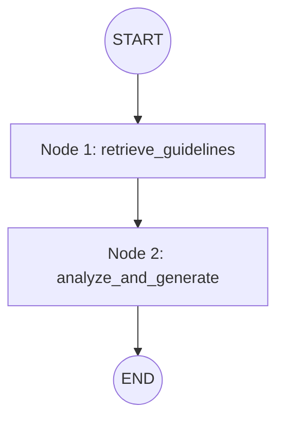

# Agent Workflow Documentation

This document outlines the explicit state management and LangGraph setup utilized by the Agentic AI Assessment Assistant.

## 1. Graph Workflow Visualized



## 2. State Management (AgentState)

The system utilizes `typing.TypedDict` to pass variables securely through the nodes of the graph. At each node, the state dictionary is updated and returned.

**Initial State Passed to `invoke()`**:
```python
{
    "query": "Is this a good biology question?",
    "assessment_context": "What does mitochondria do?",
    "retrieved_pedagogy": "",
    "numeric_model_difficulty": "",
    "errors": ""
}
```

## 3. Node Descriptions

### Node 1: `retrieve_guidelines(state)`
- **Goal:** Contextualize the prompt with documented learning science.
- **Action:** Evaluates `query` and `assessment_context` using `sentence-transformers` locally to query a predefined `FAISS` vector index holding evaluation criteria (Bloom's Taxonomy, phrasing tips).
- **State Updated:** Updates `retrieved_pedagogy` key with raw textbook strings.

### Node 2: `analyze_and_generate(state)`
- **Goal:** Synthesize the inputs and execute evaluating reasoning. 
- **Action:** Takes `retrieved_pedagogy` and structures a prompt strictly commanding adherence to the pedagogical rules. Fires the prompt to Google Gemini 1.5 Flash using LangChain. Forces JSON-structured adherence via Pydantic mapping (`AssessmentReport`).
- **State Updated:** Updates `final_report` (A populated Pydantic Object) or updates `errors` if tracing failed.

## 4. Hallucination Reduction Strategies Supported by Graph
1. **Explicit External Truth (RAG):** The model is directly seeded with pedagogy guidelines via FAISS (`retrieve_guidelines`). It cannot invent its own evaluation metrics.
2. **Schema Forcing:** Utilizing `with_structured_output` ensures the LLM does not generate conversational fluff like "Sure! Here is your assessment". It must directly populate arrays of data.
3. **Reference Demands:** The Pydantic schema demands `refs: List[str]`, forcing the LLM to tie its assertions back to the retrieved text.
