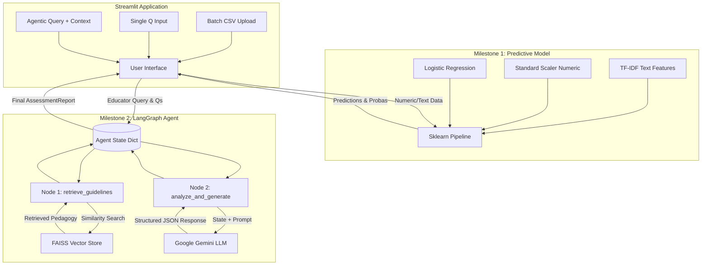

# System Architecture Diagram & Input-Output Specification

## 1. System Architecture Diagram



## 2. Input-Output Specification (Agent Module)

### Inputs
The system expects an initial state containing string inputs from the Streamlit frontend.
- `query` (string): The general question or prompt from the educator (e.g., "Melt these questions down and tell me if they are fair.")
- `assessment_context` (string): The raw text of the drafted questions to be evaluated.

### Core Processing
1. **RAG Search Strategy**: Concatenates `{query} {assessment_context}` to generate an embedding. Queries FAISS local index for top `K=3` relevant chunks from `pedagogy_guidelines.txt`.
2. **Generative Processing**: LangChain's `with_structured_output` mechanism forces the LLM to map its reasoning tokens into a predefined JSON schema (via Pydantic).

### Output
The system yields a `final_report` which maps exactly to the `AssessmentReport` schema.

```json
{
  "summary": "String detailing the holistic overview.",
  "gaps": ["Array", "of", "strings", "detailing", "flaws."],
  "advice": ["Array", "of", "actionable", "recommendations."],
  "refs": ["Array", "of", "pedagogical", "citations."],
  "disclaimer": "String indicating AI generation."
}
```
